# League of Legends Win Prediction at 10 Minutes

Binary classification project predicting match outcomes from early-game metrics in Diamond-ranked League of Legends games. 21 models were compared across logistic regression variants, tree-based ensembles, SVMs, discriminant analysis, Naive Bayes, and a neural network — with the final model selected on interpretability rather than raw accuracy.

---

## Table of Contents

- [Dataset](#dataset)
- [Exploratory Data Analysis](#exploratory-data-analysis)
- [Feature Engineering](#feature-engineering)
- [Preprocessing](#preprocessing)
- [Models](#models)
- [Results](#results)
- [Model Selection](#model-selection)
- [Variable Importance & SHAP](#variable-importance--shap)
- [Requirements](#requirements)

---

## Dataset

**Source:** [League of Legends Diamond Ranked Games (10 min) — Kaggle](https://www.kaggle.com/datasets/bobbyscience/league-of-legends-diamond-ranked-games-10-min)

~10,000 Diamond-ranked games with a snapshot of game state at the 10-minute mark. Target variable: `blueWins` (1 = blue team won, 0 = red team won). Class balance is approximately 50/50.

---

## Exploratory Data Analysis

- No missing data confirmed via `missmap()`
- Summary statistics and distribution plots generated with `Desc()` and `DataExplorer`
**[View Full EDA Report](https://tomatoooooooo.github.io/League-Win-Prediction/eda_report.html)**
- Distribution plots split by outcome showed clear separation for gold and experience variables, weaker separation for kill/ward metrics

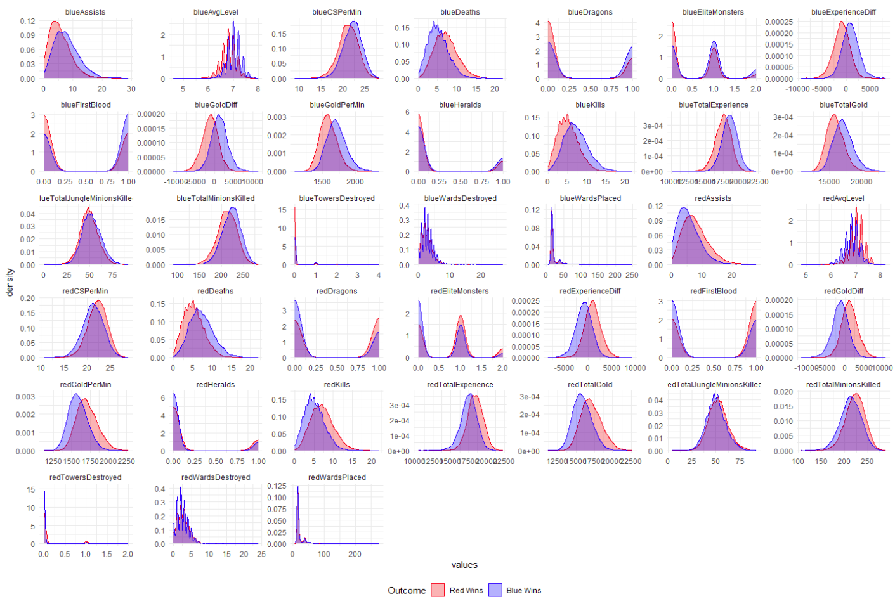

- Correlation matrix revealed strong multicollinearity between red/blue mirror columns and between difference columns and their component totals

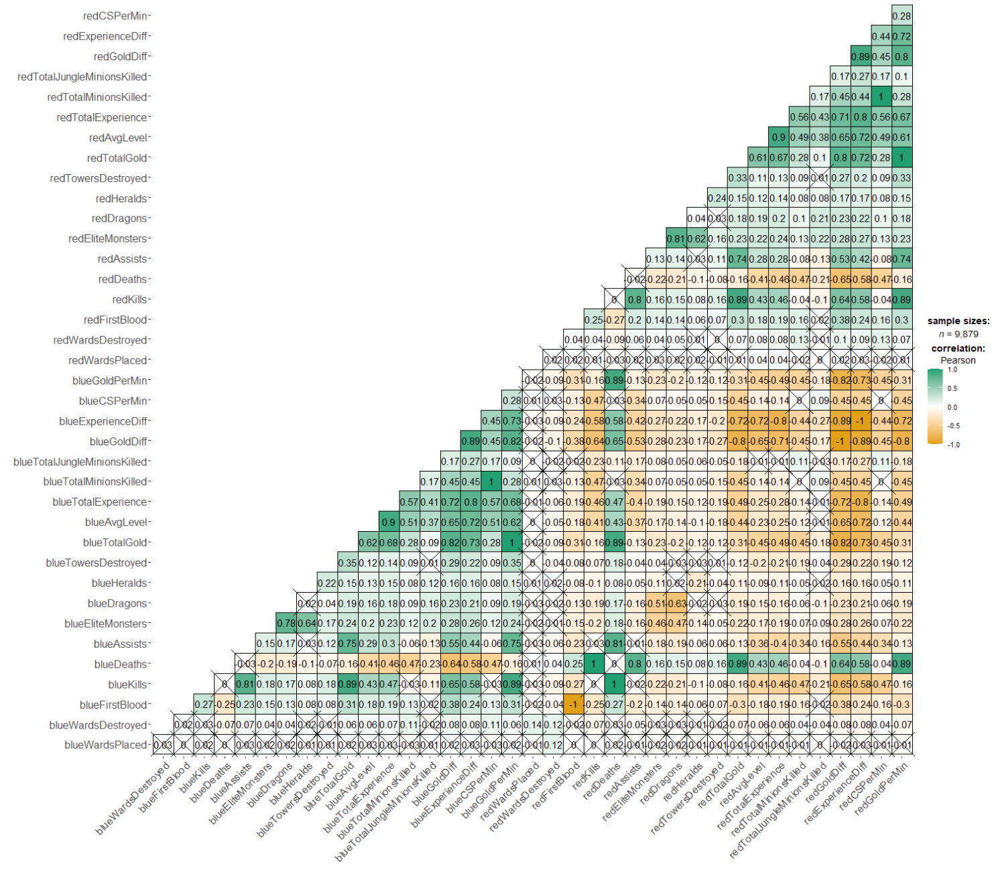

---

## Feature Engineering

Redundant columns removed first:

| Column removed | Reason |
|---|---|
| `redFirstBlood` | Exact mirror of `blueFirstBlood` |
| `redGoldDiff` | Negative of `blueGoldDiff` |
| `redExperienceDiff` | Negative of `blueExperienceDiff` |
| `redKills` | Equal to `blueDeaths` |
| `redDeaths` | Equal to `blueKills` |
| `blueGoldPerMin` | Total gold / 10 — derivable |
| `redGoldPerMin` | Total gold / 10 — derivable |
| `blueCSPerMin` | Total CS / 10 — derivable |
| `redCSPerMin` | Total CS / 10 — derivable |

Four features engineered:

```r
# Share of total game gold owned by blue team
data$goldshare <- data$blueTotalGold / (data$blueTotalGold + data$redTotalGold)

# Share of total game experience owned by blue team
data$xpshare <- data$blueTotalExperience / (data$blueTotalExperience + data$redTotalExperience)

# Combined objective score (dragon + herald)
data$blueObjectives <- data$blueDragons + data$blueHeralds
data$redObjectives  <- data$redDragons  + data$redHeralds
```

Distribution plots confirmed all four engineered features provide meaningful class separation.

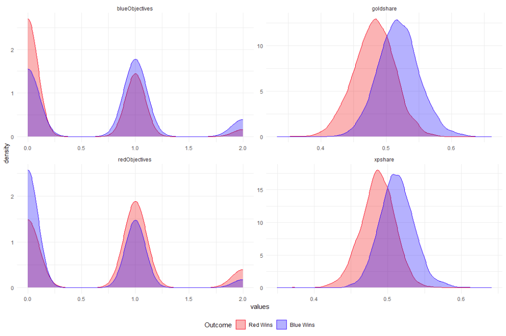

---

## Preprocessing

**Train / Validate / Test split:** 72% / 18% / 10%

```r
set.seed(0318)
index  <- createDataPartition(data$blueWins, p = 0.9, list = FALSE)
index2 <- createDataPartition(train$blueWins, p = 0.8, list = FALSE)
```

**Scaling:** StandardScaler (center + scale) fit on training data only, applied to validate and test to prevent leakage. Near-zero variance columns removed via `nzv` — tower destruction columns dropped as towers are rarely destroyed before 10 minutes.

```r
pre_proc <- preProcess(x_train, method = c("center", "scale", "nzv"))
```

---

## Models

All models evaluated on the validation set using:
- **AUC-ROC** with Youden's J optimal threshold selection
- **Accuracy**, **Sensitivity**, **Specificity** via confusion matrix

A custom ROC curve function was built to visualize the optimal threshold for each model:

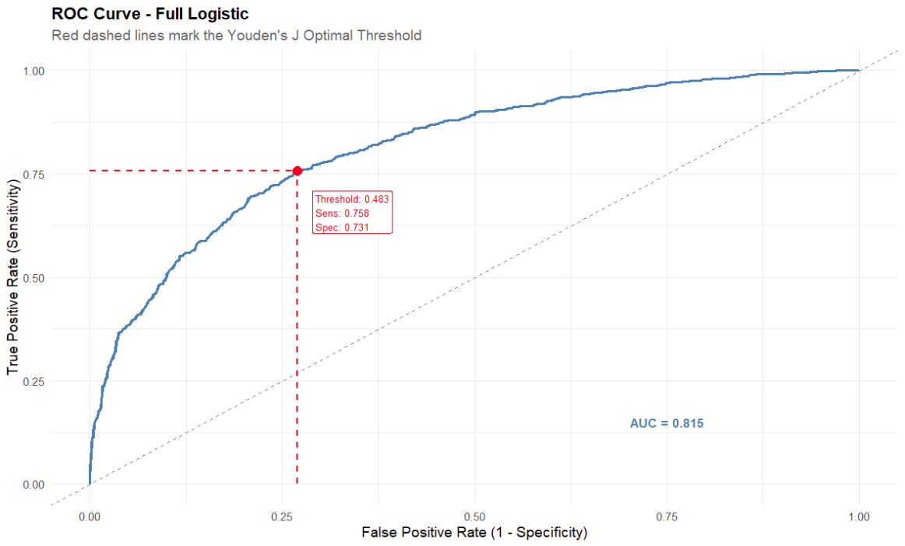

### Logistic Regression

| Model | AUC | Accuracy |
|---|---|---|
| Full Logistic | 0.815 | 74.4% |
| Stepwise AIC | 0.814 | 74.5% |
| Stepwise BIC | 0.814 | 74.6% |
| Elastic Net (α=0.45) | 0.815 | 74.5% |
| PCA Logistic | 0.815 | 74.4% |

Stepwise BIC reduced the model to three predictors: `goldshare`, `blueDragons`, and `blueExperienceDiff`. Elastic net alpha tuned via cross-validated AUC across α ∈ [0, 1].

### Discriminant Analysis

| Model | AUC | Accuracy |
|---|---|---|
| LDA | 0.815 | 74.2% |
| PCA LDA | 0.814 | 74.2% |
| PCA QDA | 0.796 | 73.2% |
| LDA Reduced | 0.814 | 74.5% |
| QDA Reduced | 0.813 | 74.2% |

Full LDA encountered heavy multicollinearity — PCA and reduced model variants used to address this.

### Random Forest

| Model | AUC | Accuracy |
|---|---|---|
| Random Forest (ranger) | 0.806 | 73.3% |

OOB error stabilised at ~300 trees. Hyperparameters tuned via 5-fold CV grid search over `mtry` ∈ {2, 5, 8, 11} and `min.node.size` ∈ {1, 5, 10}.

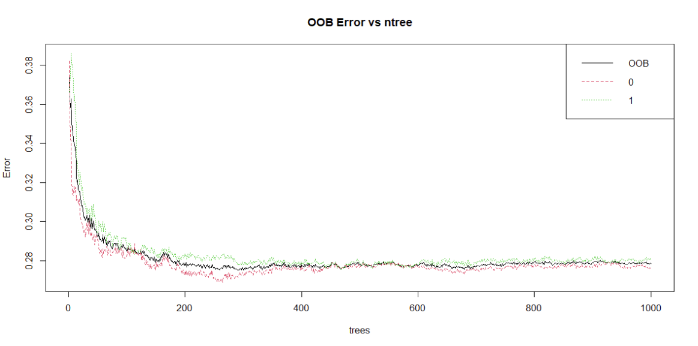

### KNN

| Model | AUC | Accuracy |
|---|---|---|
| KNN | 0.785 | 71.0% |

Weakest performer — consistent with the relatively linear decision boundary in this dataset.

### Support Vector Machines

| Model | AUC | Accuracy |
|---|---|---|
| SVC Linear | 0.815 | 74.2% |
| SVC Radial | 0.801 | 73.3% |
| SVC Linear Reduced | 0.814 | 74.5% |

Linear kernel matched logistic regression performance, confirming the largely linear structure of the problem.

### Naive Bayes

| Model | AUC | Accuracy |
|---|---|---|
| Naive Bayes | 0.812 | 74.2% |
| Naive Bayes PCA | 0.810 | 74.4% |
| Naive Bayes Reduced | 0.814 | 74.5% |

### Gradient Boosting

| Model | AUC | Accuracy |
|---|---|---|
| CatBoost | 0.811 | 74.7% |
| LightGBM | 0.812 | 74.1% |

Both tuned via Bayesian optimisation with 20 initial points and 50 iterations using `ParBayesianOptimization`. CatBoost Bayesian optimisation converged toward shallow trees and small leaf sizes, suggesting the underlying signal in the data is relatively simple.

### Neural Network

| Model | AUC | Accuracy |
|---|---|---|
| Neural Net (PyTorch) | 0.813 | 74.3% |

Two-layer network with batch normalisation and dropout (0.3 / 0.2). Trained for 400 epochs with SGD (lr = 0.01) and BCEWithLogitsLoss. Linear activation outperformed ReLU, Sigmoid, Tanh, and LeakyReLU — a further indicator of the largely linear relationship in the data. R/Python interop via `reticulate`.

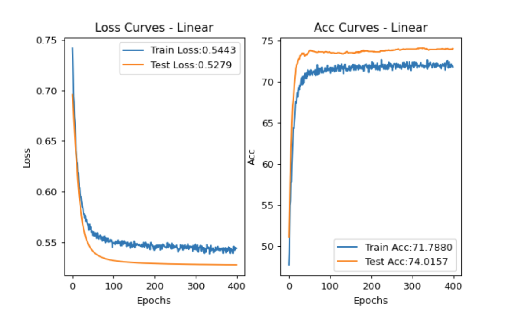

---

## Results

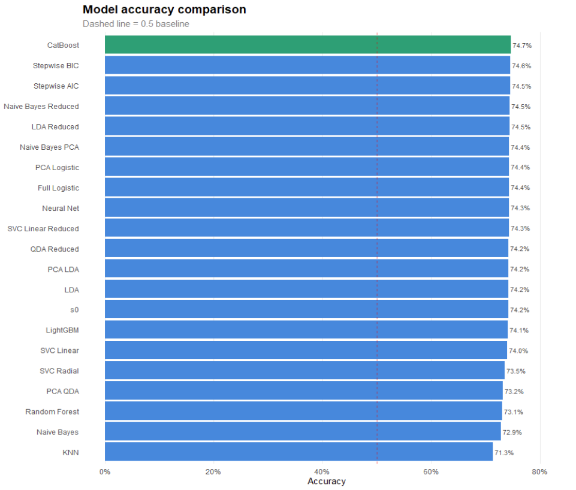

All 21 models converged to a remarkably narrow accuracy band of 71–75%, with AUC-ROC between 0.785 and 0.815. This ceiling is consistent with the inherent unpredictability of a 10-minute snapshot in a 30–40 minute game.

---

## Model Selection

**Final model: Stepwise BIC Logistic Regression**

Although CatBoost achieved the highest raw accuracy (74.7%), it was only marginally ahead of the Stepwise BIC model (74.6%). Given that most models performed almost identically, the simplest and most interpretable model was selected.

The BIC model uses only three predictors:

```
blueWins ~ goldshare + blueDragons + blueExperienceDiff
```
**Model Calibration:**


A model with strong AUC can still produce unreliable probabilities —  a predicted 70% win chance means nothing if blue actually wins 90% of  the time in those games. The calibration plot checks whether predicted probabilities match observed win rates across the full range of predictions.

The final Stepwise BIC model is exceptionally well calibrated. Points track closely along the diagonal across the entire probability range, meaning a predicted 30% win probability genuinely corresponds to roughly a 30% observed win rate, and so on.

**Final test set performance:**
- AUC: **0.827**
- Accuracy: **74.9%**

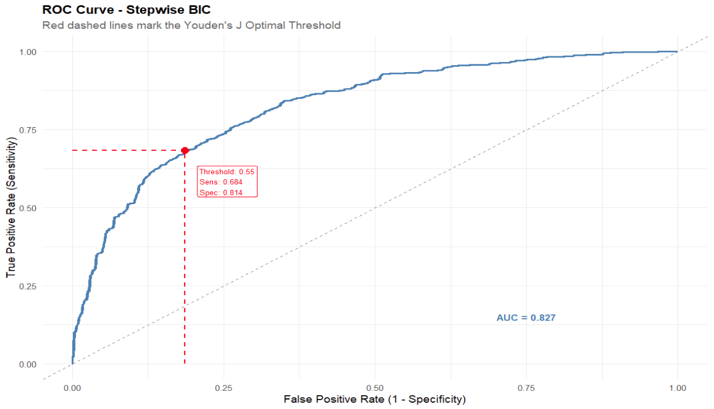


---

## Variable Importance & SHAP

SHAP analysis was conducted across Random Forest, Logistic Regression, and CatBoost to validate feature importance across model classes.

### SHAP — Random Forest

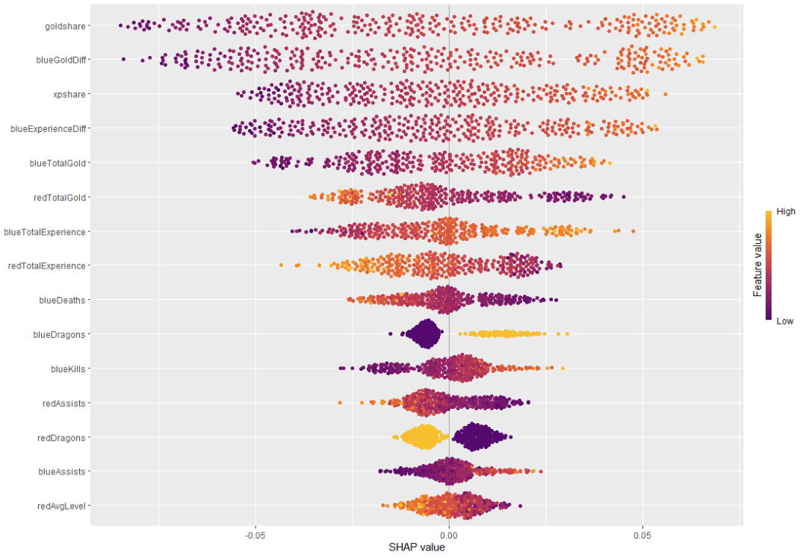
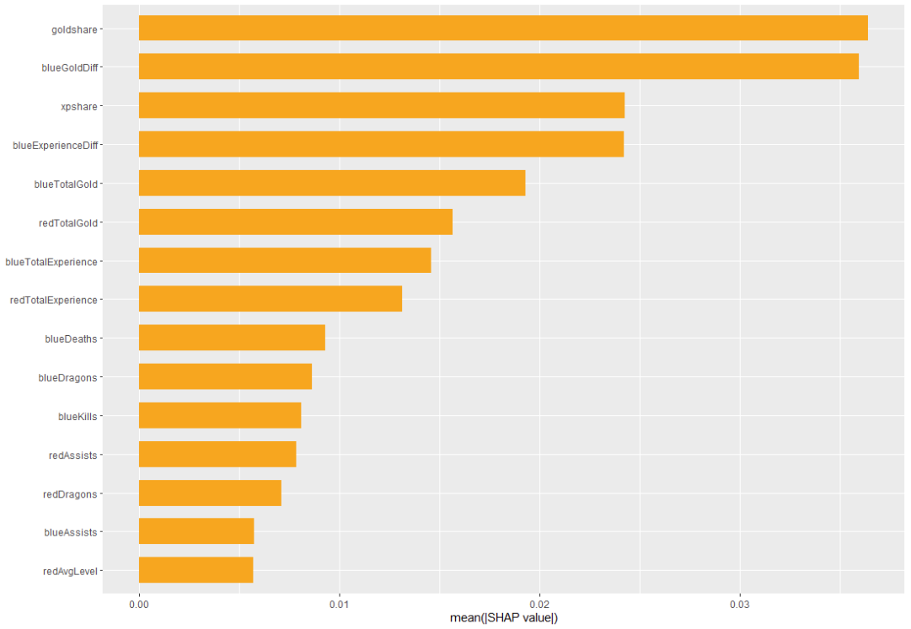

### SHAP — Logistic Regression

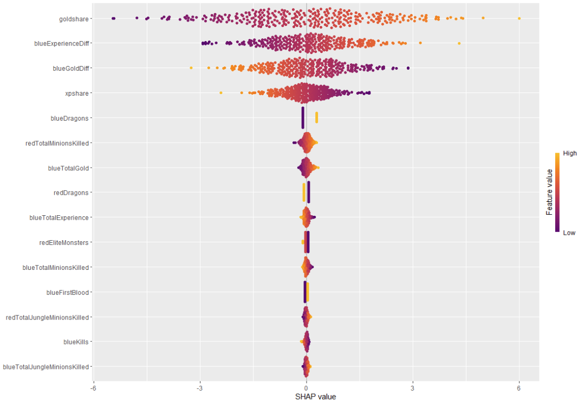
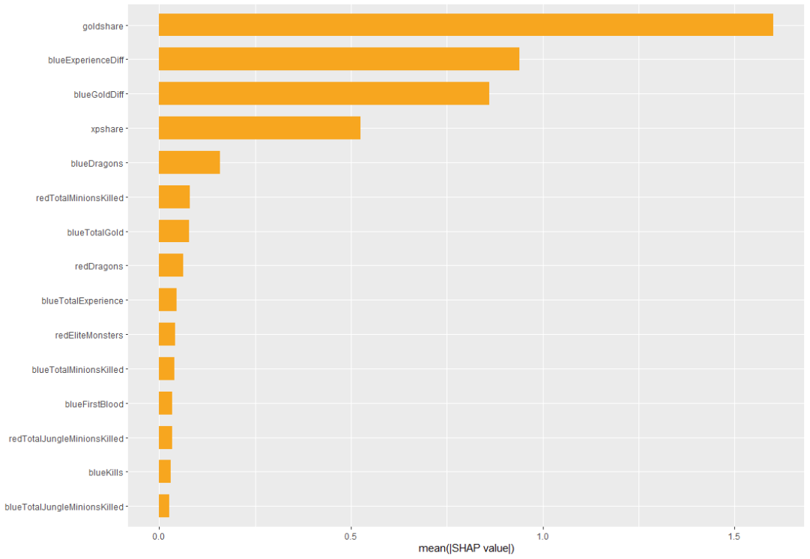


### SHAP — CatBoost

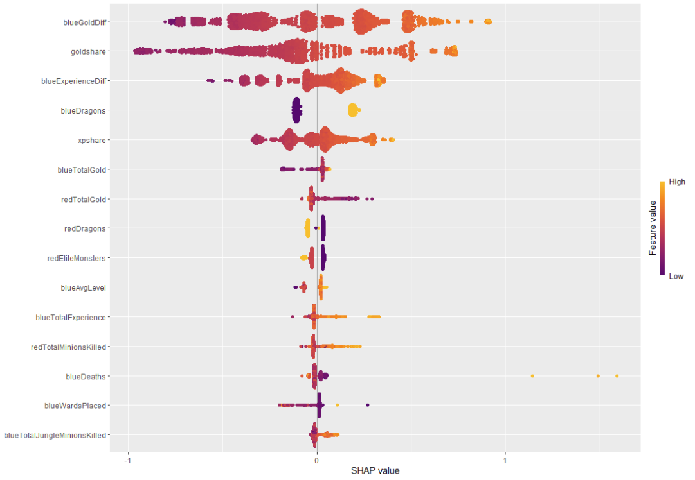
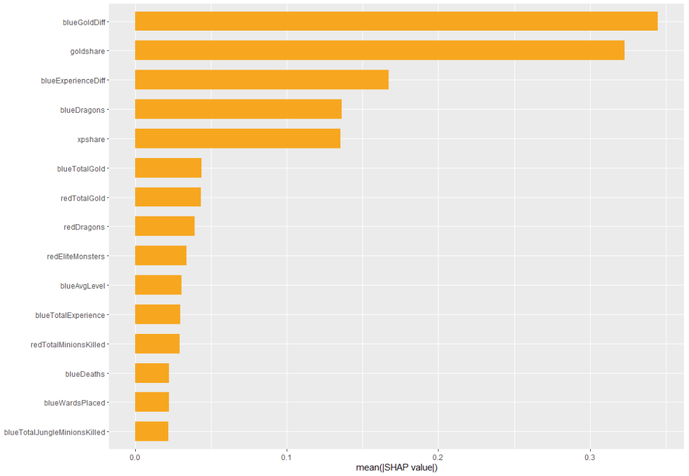

**Key findings consistent across all three models:**
- `goldshare` (engineered) was the strongest predictor, outperforming raw `blueGoldDiff`
- Experience differential was secondary to gold differential
- Early dragon control had meaningful but inconsistent impact
- Raw kill counts were not significant predictors — resource efficiency mattered more than aggression


---

## Conclusion

Perhaps the most striking finding of this project is not which model won, but how little it mattered. Across 21 models spanning logistic regression, tree ensembles, SVMs, discriminant analysis, Naive Bayes, gradient boosting, and a neural network, accuracy converged to a remarkably narrow band of 71–75% with AUC between 0.785 and 0.815. No amount of model complexity meaningfully moved the needle.

The reason becomes clear when you look at what the models actually learned. Stepwise BIC — the most aggressive variable selection method — reduced the problem to just three predictors: `goldshare`, `blueExperienceDiff`, and `blueDragons`. Despite this dramatic simplification, it matched the performance of fully specified models and outperformed heavily tuned gradient boosters on the test set. SHAP analysis told the same story — `goldshare` and experience differential dominated importance rankings consistently across Random Forest, Logistic Regression, and CatBoost, with dragons providing secondary but meaningful signal.

The linear activation function outperforming ReLU, Sigmoid, and Tanh in the neural network adds a final punctuation mark: the underlying relationship in this data is largely linear. Gold leads translate to wins, experience leads translate to wins, and securing early objectives compounds both. Everything else — kills, wards, assists, jungle pressure — is largely noise at the 10-minute mark, or already captured indirectly through its effect on gold and experience.

This points to a fundamental ceiling in early-game prediction. At 10 minutes, a League of Legends match is not yet decided, but it is leaning. The signal exists, it is real, and it is almost entirely encoded in three numbers.

---

## Requirements

### R

```r
library(tidyverse)
library(reticulate)
library(DescTools)
library(DataExplorer)
library(pROC)
library(ggstatsplot)
library(caret)
library(car)
library(glmnet)
library(ranger)
library(kernlab)
library(catboost)
library(ParBayesianOptimization)
library(lightgbm)
library(doParallel)
library(Amelia)
library(randomForest)
library(shapviz)
library(kernelshap)
```

### Python

```bash
pip install torch pandas numpy matplotlib
```

> Note: CatBoost for R requires manual installation from the [CatBoost GitHub releases](https://github.com/catboost/catboost/releases).

---

MIT License. Use freely.
